#   Trabajo Práctico de Modelos Avanzados de Computación
:school: Universidad de Huelva  
:books: Curso 2020-2021    

##  Intención de la práctica
El objetivo de la práctica es realizar una pequeña aplicación, desarrollada en Haskell, la cual ponga en funcionamiento el algoritmo Cocke-Younger-Kasami usado para verificar si una cadena de entrada pertenece al lenguaje descrito por una gramática dada, en este caso, expresada en Forma Normal de Chomsky.

## Definición de tipos de datos
Este algoritmo se basa en el uso de una matriz donde las celdas contienen conjuntos de símbolos No terminales de la gramática. Estos símbolos son a su vez reconocidos por los símbolos No Terminales presentes en las celdas de niveles superiores. Si en la celda ubicada en el último nivel se encuentra el símbolo inicial de la gramática, quiere decir que a partir de ese símbolo se puede derivar toda la cadena de entrada y, por tanto, dicha cadena pertenece al lenguaje.

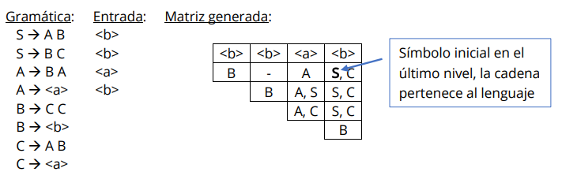
    
Como se puede ver en este ejemplo de aplicación del algoritmo CYK, es necesario tener
almacenada la gramática y la cadena de entrada. Ambas serán introducidas al programa a
través de un fichero. El formato del fichero de gramática será el siguiente:

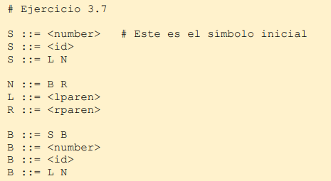

Los símbolos No Terminales serán aquellos caracteres en mayúsculas, y los Terminales vendrán dados en minúsculas y entre los caracteres ‘<’ y ’>’.

Cada línea será una regla de la gramática, y el fichero puede contener comentarios que comenzarán por el carácter ‘#’. Estos comentarios no serán tomados en cuenta al leerse el fichero.

El formato del fichero donde venga definida la cadena de entrada es más simple:

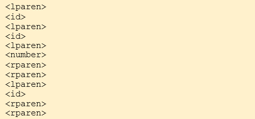

Cada línea del fichero corresponde a un símbolo Terminal de la gramática. Todas las líneas del fichero forman la cadena de entrada.

Una vez leídos ambos ficheros, hay que establecer cómo serán tratados para guardar su información y así poder usarla.

La gramática será una lista de reglas, donde la primera regla será del símbolo inicial de la gramática. En estas reglas estarán presentes los símbolos No Terminales y Terminales de la gramática, los cuáles serán representados como cadenas de caracteres, identificados con alias de String:

```
type NoTerminal = String
type Terminal = String
```

Con estos nuevos alias, se define un nuevo tipo de dato Regla que contendrá la información necesaria de una regla de la gramática:

```
data Regla = ReglaN NoTerminal NoTerminal NoTerminal
            | ReglaT NoTerminal Terminal
            | ReglaNula
            deriving (Eq, Show)
```

Este tipo dato Regla puede hacer referencia a:
- Una regla Terminal, en la que un símbolo No Terminal produce un símbolo Terminal: A ::= <a>.
- Una regla No Terminal, en la que un símbolo No Terminal produce dos símbolos No Terminales: A ::= B C.
- Una regla Nula, este será el tipo de regla empleado para las líneas en blanco de la gramática o aquellas reglas que tengan más de 2 símbolos en su parte derecha.

Definido el dato regla, podemos establecer que una gramática será una lista de reglas, y una entrada, una lista de símbolos Terminales:

```
type Gramatica = [Regla]
type Entrada = [Terminal]
```

Declarados los tipos de datos, es preciso tomar el contenido del fichero leído y adaptarlo para guardar los datos en las estructuras definidas:
- Para el fichero de gramática, primero se dividirá el contenido en líneas, cada línea del fichero será un elemento candidato a ser regla. Estas líneas serán tratadas eliminando los posibles comentarios que puedan contener. Una vez eliminados, se trocea cada línea por las separaciones entre los símbolos (los espacios). Puede darse tres situaciones:
    - Que haya 3 elementos, entonces con esa línea se creará una regla Terminal, donde el       símbolo No Terminal será el primer elemento, y el símbolo Terminal, el último (el           símbolo intermedio se corresponde al símbolo de producción de la regla ‘::=’ y es           ignorado).
    - Que haya 4 elementos, entonces con esa línea se creará una regla No Terminal con el       primer elemento como símbolo No Terminal de la regla, y los dos últimos como símbolos       producidos.
    - Que sea otro número de elementos, entonces se creará una regla Nula.
- Para el fichero de cadena de entrada, se dividirá el contenido del fichero en líneas y cada línea será un símbolo Terminal. Previamente se eliminan los posibles espacios que pudiera haber en cada línea.

Por último, para poder aplicar el algoritmo, se definen los tipos necesarios para el uso de la tabla. Se considerará que una celda de la tabla será una lista de símbolos No Terminales, y, como se mencionó antes, las celdas de la tabla se encuentran por niveles. Estos niveles serán las diagonales de la tabla, siendo el nivel superior la diagonal con una única celda:

```
type Celda = [NoTerminal]
type Diagonal = [Celda]
```

## Implementación del algoritmo
Una vez definidas las estructuras donde se almacenará la información correspondiente a la gramática y a la cadena de entrada y cargados ambos desde sus respectivos ficheros, es momento de comenzar el análisis de la cadena para verificar si pertenece al lenguaje definido por la gramática o no.

Como se mencionó antes, el algoritmo CYK trabaja por niveles, donde en cada nivel, los símbolos No Terminales presentes reconocen a los símbolos de los niveles inferiores. Estos niveles serán las diagonales de la tabla que se irá rellenando.

Para la gramática:

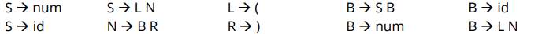

Con la cadena de entrada: ( id ( id ( num ) ) ( id ) )
Se obtiene la siguiente tabla:

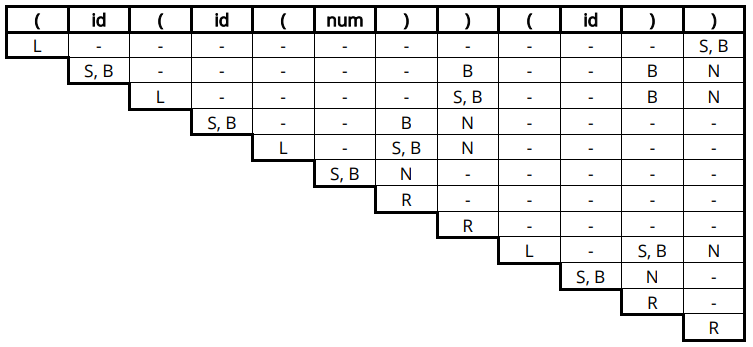

Se pueden diferenciar dos tipos de diagonales:
- Primera diagonal: en ella aparecen los símbolos No Terminales de la gramática que tienen una regla con la que pueden producir el símbolo Terminal de la entrada que se encuentra al inicio de la columna.
- Diagonales internas: en ellas se encuentran los símbolos No Terminales que en sus reglas pueden producir el par de símbolos No Terminales, el primero a su misma altura en las celdas de las diagonales anteriores (la misma fila), y el otro en su misma columna, pero en las celdas de las diagonales inferiores. El contenido de la celda es el resultado de hacer este proceso tomando una a una todas las celdas en la misma fila y comparando con las celdas que se encuentren en la misma columna (primera en la fila con primera en la columna, segunda con segunda … ).
- Diagonal final: esta diagonal se obtiene del mismo modo que las demás diagonales internas, pero sólo tendrá una única celda.

Como se verá a continuación, la forma de obtener estas diagonales es diferente según sea la diagonal primera o una interna.

### Creación de la primera diagonal
Para la primera diagonal, dado que tiene el mismo número de elementos que símbolos Terminales hay en la cadena de entrada, se creará usando únicamente dicha información, además del uso de la Gramática para saber qué reglas se aplican.

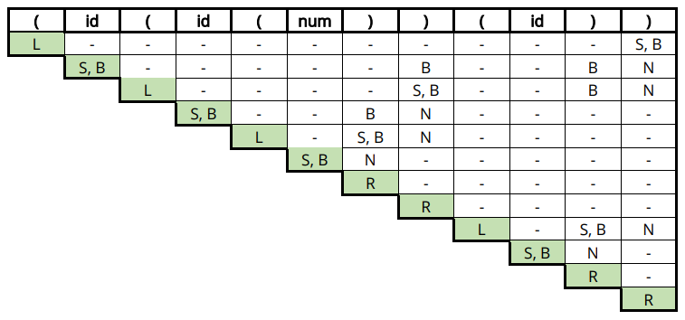

Para esto, se han implementado dos funciones:

```
- reglasReconoceTerminal :: Terminal -> Gramatica -> Celda
- rellenaPrimeraDiagonal :: Entrada -> Gramatica -> Diagonal
```

La primera de ellas, a partir de un símbolo Terminal, devuelve una lista de todos los símbolos No Terminales de la gramática que tengan una regla que produzcan dicho Terminal. Esta lista de No Terminales forma una celda de la tabla.

La segunda función realizará llamadas a la función anterior, profundizando de forma recursiva en la cadena de entrada. Cuando llega al final de la cadena, obtiene solo una celda, entonces, mediante la devolución por recursión, va creando la diagonal completa.

### Creación de las diagonales intermedias
Una vez creada la primera diagonal, se procede a la creación de todas las diagonales internas. El motivo por el que es necesario crear la primera diagonal antes es que estas diagonales intermedias requieren conocer los símbolos No Terminales presentes en las diagonales inferiores, puesto que los símbolos No Terminales que van a obtenerse serán aquellos que reconozcan los ya presentes.

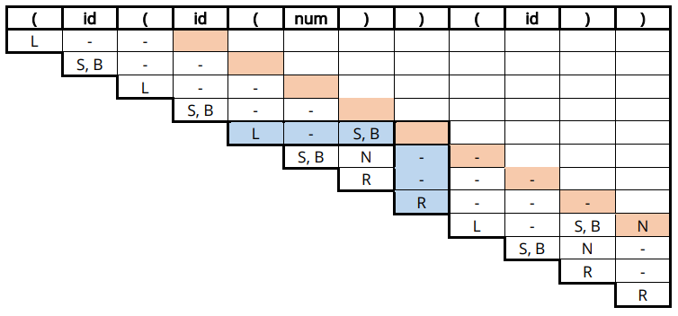

A partir de los datos obtenidos de las diagonales anteriores, se comienza a crear la siguiente diagonal. Recursivamente, se profundiza en la diagonal nueva, hasta llegar al extremo inferior. Desde ahí, se construye la nueva diagonal, añadiendo en cada llamada recursiva una nueva celda a la diagonal, por tanto, la diagonal crece de abajo hacia arriba.

Como se puede apreciar, al momento de crearse una nueva celda, se deben de tomar de las diagonales anteriores una serie de celdas, las que se encuentran en la misma fila, y las que se encuentran en la misma columna. Para ello, se han implementado las siguientes funciones, que trabajan con un índice dado, que se corresponde con la posición que la celda va a tener en la nueva diagonal:

```
- fila :: [Diagonal] -> Int -> [Celda]
- columna :: [Diagonal] -> Int -> [Celda]
```

Con ambas listas de celdas, se procede a tomar las celdas de dos en dos, para ver qué No Terminales producen los símbolos de estas celdas. Se comprobarán las celdas en este orden:

- {L} con {-} → Primera de la fila con primera de la columna
- {-} con {-} → Segunda con segunda
- {S, B} con {R} → Tercera con tercera

La forma de realizar esta comprobación es mediante la siguiente función:

```
 recorreParesDeCeldas :: [Celda] -> [Celda] -> Gramatica -> Celda
```

Esta función recibe ambas listas y devuelve la nueva celda. Internamente, llama a la siguiente función, que será la que realice la comparación celda a celda:

```
reglasReconoceDosCasillas :: Celda -> Celda -> Gramatica -> Celda
```

Esta función recibe dos celdas, una de cada lista, y devuelve una celda con los posibles símbolos No Terminales que pueden reconocer los símbolos de las celdas.

Aunque devuelva una celda, en realidad esta celda es completada con los símbolos obtenidos tras analizar el resto de los pares de celdas.

Internamente, toma uno a uno (por recursión) los símbolos No Terminales de la primera celda y lo une con los posibles símbolos No Terminales que haya en la segunda celda, obteniendo así los símbolos No Terminales que producen a ambos.

Esta comprobación se realiza de forma similar a la de obtener los símbolos No Terminales que producen los símbolos Terminales, mediante la siguiente función:

```
reglasReconoceParNoTerminal :: NoTerminal -> NoTerminal -> Gramatica -> Celda
```

Esta función recibe dos símbolos No Terminales, el primero será de una celda situada en la misma fila, y el segundo será de la celda situada en la columna. Devolverá los símbolos No Terminales que produzcan a ambos, en el orden presentados a la función (primero el símbolo de la celda en la misma fila, y luego el símbolo de la celda de la misma columna).

La forma de realizar el recorrido de esta nueva diagonal es mediante la siguiente función:

```
recorreDiagonal :: [Diagonal] -> Int -> Gramatica -> Diagonal
```

Esta función recibe todas las diagonales ya creadas y un número que significa el índice de la casilla que va a crear y que luego unirá al resto de casillas generadas por recursión. Recibirá como valor inicial de índice, el 0, dado por la función:

```
creaDiagonal :: [Diagonal] -> Gramatica -> Diagonal
```

Esta función se encarga de iniciar la recursión de la función anterior, llamándola con 0 como primer índice. Devuelve la diagonal generada por la función recursiva anterior.

Por último, para crearse la tabla, se utiliza la función:

```
creaDiagonales :: [Diagonal] -> Gramatica -> [Diagonal]
```

Esta función recibe la lista de las diagonales ya creadas, las diagonales inferiores, y devuelve una lista de diagonales compuesta por las que ha recibido más la nueva diagonal que acaba de crear. Esto se realizará de forma recursiva hasta que no pueda haber diagonales superiores, es decir, cuando se haya creado la última diagonal de longitud 1. En ese momento, habrá finalizado la creación de la tabla del algoritmo CYK.

Cabe destacar que, como puede verse en la definición de la función, recibe siempre una lista de las diagonales ya creadas. Como se mencionó antes, la primera diagonal se crea de forma diferente a las demás, por tanto, en la primera llamada recursiva, la lista de diagonales que recibirá será una lista formada por una única diagonal, que se corresponderá a la primera diagonal de la tabla. Esto se realiza en la función:

```
algoritmoCYK_CreaTabla :: Gramatica -> Entrada -> [Diagonal]
```

Esta función recibe la gramática y la cadena de entrada, genera la primera diagonal de la tabla a partir de estos datos, y se la pasa a la función previa junto con la gramática que recibe. Finalmente devuelve la tabla completa.

### Interpretación de la tabla

Finalmente, obtenida la tabla mediante la creación de sus diagonales, es momento de ver si la cadena de entrada recibida inicialmente pertenece al lenguaje definido por la gramática o no. Para ello, tan sólo hay que comprobar si el símbolo inicial de la gramática se encuentra en la última celda de la tabla (esquina superior derecha).

Si el símbolo inicial se encuentra ahí, significa que desde ese símbolo se puede derivar toda la cadena de entrada y, por tanto, dicha cadena pertenece al lenguaje.

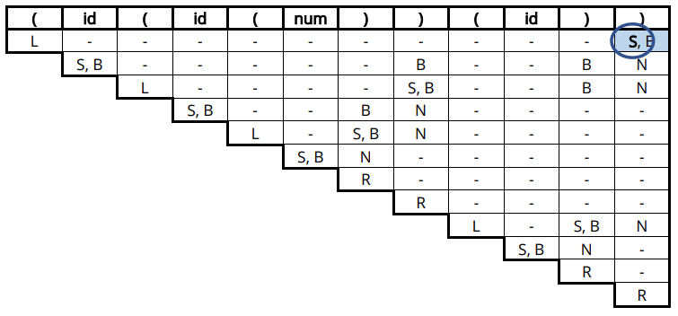

El símbolo inicial de la gramática será aquel que se encuentre en la primera regla de la gramática, en este caso, será el símbolo S, por la regla: S → num.

La forma de obtener dicho símbolo en el código es mediante la siguiente función:

```
primerSimbolo :: Gramatica -> NoTerminal
```

Que toma la primera regla de la gramática, sea Terminal o No Terminal, y devuelve el símbolo que aparezca en ella.

La función que realiza la comprobación final es la siguiente:

```
 algoritmoCYK :: Gramatica -> [Diagonal] -> Resultado
 algoritmoCYK g tabla =
    let sInicial = primerSimbolo g
        n = (length tabla) - 1
    in case elem sInicial ((tabla !! n) !! 0) of True -> Correcta
                                                 False -> Incorrecta

```

Recibe la gramática y la tabla generada, extrae el símbolo inicial de la gramática, accede a la última diagonal de la tabla y comprueba si el símbolo inicial se encuentra en la celda seleccionada.

## Visualización de los resultados
Con objetivo de poder analizar mejor el proceso seguido por el algoritmo implementado, se realizaron las siguientes funciones para poder representar gráficamente la tabla generada tal y como se muestra en los ejercicios realizados en clase.

Mediante las funciones:

```
- creaFila :: [Diagonal] -> Int -> [Celda]
- creaFilas :: [Diagonal] -> Int -> [[Celda]]
- organizaTabla :: [Diagonal] -> [[Celda]]
```

Se realiza la transformación de la tabla de estar representada como una lista de diagonales a estar representada como una lista de filas con las celdas de la tabla. Al representarse como una lista de filas, no se utiliza el alias Diagonal para hacer referencia a [Celda], para evitar confusiones.

Y mediante las siguientes funciones impuras, se realiza la visualización por pantalla de una forma básica la tabla generada:

```
- verFila :: [Celda] -> IO()
- verTabla :: [[Celda]] -> Int -> IO()
```

La forma de realizar la separación entre las columnas es muy básica. El tamaño máximo que ocupará una columna será de 14 caracteres, incluyéndose la celda de la columna y el espaciado hasta la siguiente columna. Esto hace que visualmente se vea bien sólo si no hay más de tres símbolos No Terminales por casilla y ningún símbolo No Terminal está formado por más de un carácter.

## Ejemplos de ejecución
A continuación, se mostrará una serie de pruebas de ejecución realizadas con diferentes gramáticas y cadenas de entrada.

Las visualizaciones de las tablas obtenidas han sido recortadas.

### Ejercicio Examen Modelos Avanzados de Computación 2021

Gramática: Ficheros usados: GramáticaExamen.cfg y EntradaExamen.txt


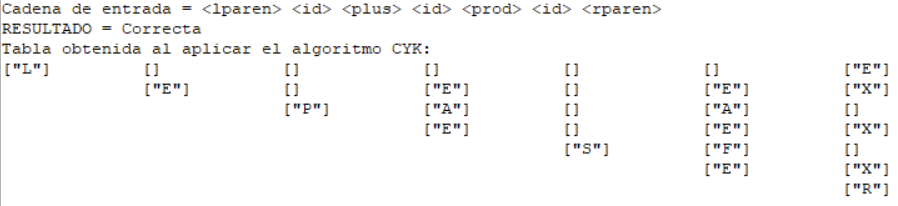

En el enunciado hay un error. La gramática rparen, es con R, no con L. Este error fue aclarado el día del examen

### Ejemplo 1

Gramática: Ficheros usados: Gramática.cfg y Entrada.txt

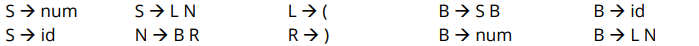
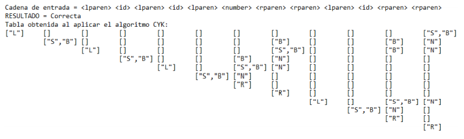

### Ejemplo 2

Gramática: Ficheros usados: G2.cfg y E2.txt

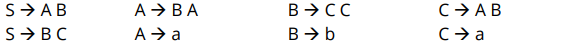
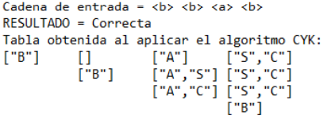

### Ejemplo 3

Gramática: Ficheros usados: G4.cfg y E4.txt

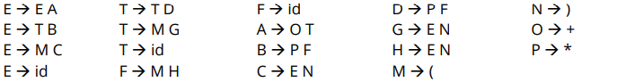
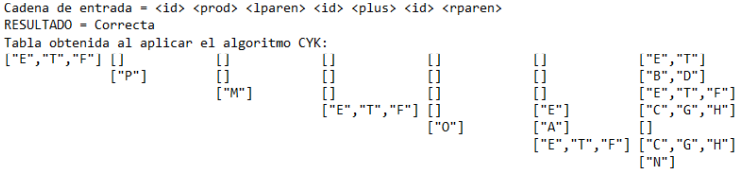

### Ejemplo 4

Gramática: Ficheros usados: G5.cfg y E5.txt

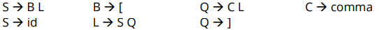
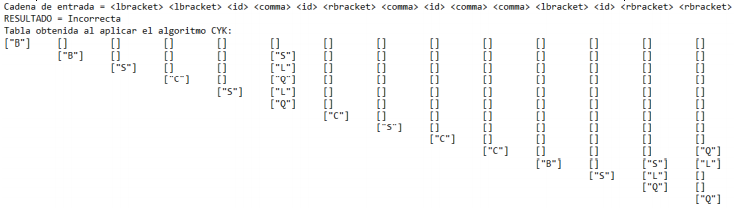

### Ejemplo 5

Gramática: Ficheros usados: G2.cfg y E22.txt

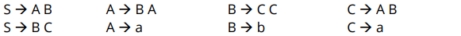
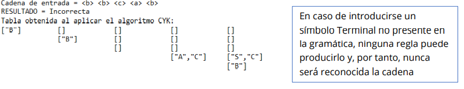

Junto al código fuente se incluyen las gramáticas y cadenas de entrada utilizadas en los ejemplos, junto a otras gramáticas.

## Bibliografía
[1. Temario Modelos Avanzados de Computación de Francisco José Moreno Velo](http://www.uhu.es/francisco.moreno/gii_mac/)  
[2. Programación Declarativa de José Carpio Cañada](http://www.uhu.es/jose.carpio/N_95.pdf)  
[3. Haskell Documentation](https://www.haskell.org/documentation/)  
